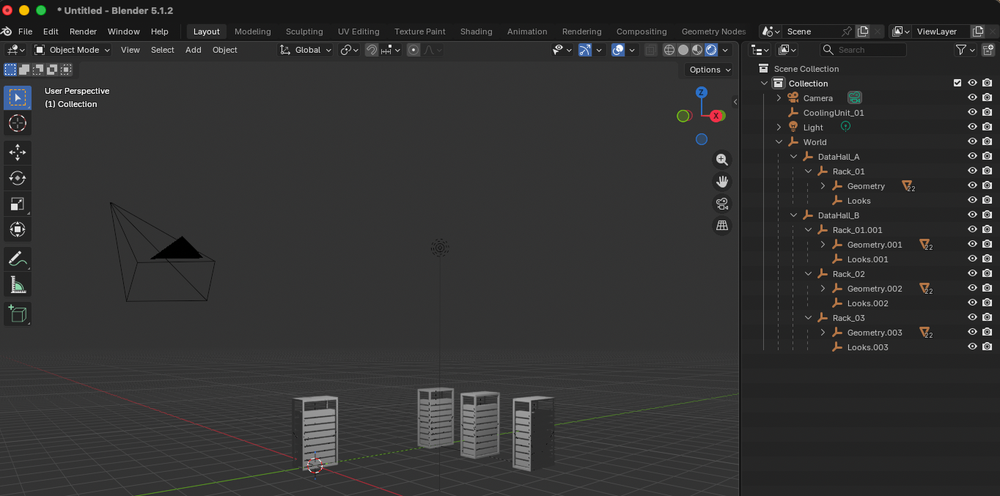

## What this project demonstrates

This project builds a tiny AI-factory digital twin one OpenUSD concept at a time.

| Step | Pressure | OpenUSD mechanism |
|---|---|---|
| 1. Describe a rack | Represent a physical asset as structured data | Prims, attributes, transforms, geometry |
| 2. Reuse the rack | Avoid duplicating asset geometry | References |
| 3. Assemble a facility | Organize assets into halls and systems | Scenegraph hierarchy |
| 4. Separate contributors | Engineering, cooling, and operations need independent ownership | Sublayers |
| 5. Resolve disagreement | Multiple contributors can author different values | Composition strength / value resolution |
| 6. Configure assets | One asset can have multiple valid configurations | Variant sets |
| 7. Manage scale | Large facilities should not require loading everything | Payloads |
| 8. Add meaning | Geometry alone is insufficient for machine consumers | Structured attributes |
| 9. Enforce requirements | Valid USD can still be unusable application data | Validation |

```text
facility.usda
├── operations.usda
├── cooling.usda
└── rack_assets.usda
    └── references rack.usda
```

The digital twin as a resolved view over independently authored information. Asset definitions remain reusable. Domain contributors remain separately managed. Composition produces the Stage consumed by downstream applications. It's not one giant canonical file.

```text
Engineering:  Rack_01.status = commissioned
Operations:   Rack_01.status = maintenance

                         ↓ composition

Stage:        Rack_01.status = maintenance
```

- ✓ `metersPerUnit`
- ✓ `upAxis`
- ✓ racks have `assetType`
- ✓ racks belong to a zone
- ✓ composition dependencies resolve
- ✓ expected variants exist

